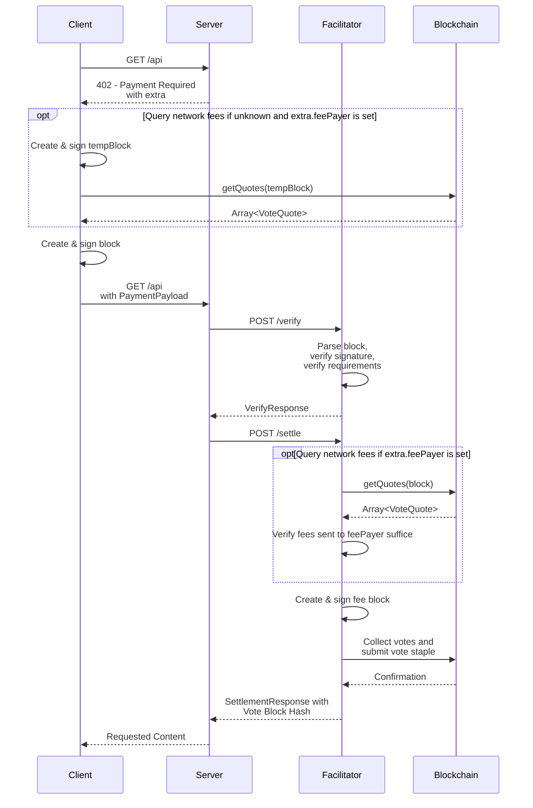

# Scheme: `exact` on `keeta`

## Summary

The `exact` scheme on Keeta transfers a specific amount of a token (such as USDC) on the Keeta network from the payer to the resource server.
The payer constructs a signed block containing the operations to fulfill the `paymentRequirements` and pay for the network's fees.
The facilitator can validate and submit the signed block to the blockchain but cannot alter it to redirect funds to any other address.

**Version Support:** This specification supports x402 v2 protocol only.

## Protocol



1.  **Client** makes a request to a **Resource Server**.
2.  **Resource Server** responds with a payment required signal containing `PaymentRequired`. If the facilitator does not support fee sponsorship, the `extra.feePayer` field is set to the account address of the entity that will pay the fee for the transaction, typically the facilitator. Otherwise `extra.feePayer` unset.
3.  **Client** creates and signs a block with a `SEND` operation to transfer the specified amount of the token to the recipient. If the `extra.external` field is set, the client sets the `external` field to the specified value in the `SEND` operation. If `extra.feePayer` is set, the client also adds a `SEND` operation to transfer the network's fees to the specified address. The block is **not** published to the network. Optionally, if the client does not know the required fees for the transaction, it may request vote quotes from the network's representatives to calculate the expected amount of fees.
4.  **Client** serializes the signed block into its ASN.1 DER representation and encodes it as a Base64 string.
5.  **Client** sends a new request to the **Resource Server** with the `PaymentPayload` containing the Base64-encoded signed block.
6.  **Resource Server** receives the request and forwards the `PaymentPayload` and `PaymentRequirements` to a **Facilitator's** `/verify` endpoint.
7. **Facilitator** decodes and parses the signed block and verifies the block according to the [verification rules](#verification).
8. **Facilitator** returns a `VerifyResponse` to the **Resource Server**.
9. **Resource Server**, upon successful verification, forwards the payload to the facilitator's `/settle` endpoint.
10. **Facilitator** verifies the block according to the [settlement rules](#settlement). It computes and signs a fee block as the `feePayer` to pay for the fees, requests votes for the blocks from the network's representatives and publishes the combined vote staple to the network.
11. Upon successful on-chain settlement, the **Facilitator** responds with a `SettlementResponse` including the hash of the vote staple to the **Resource Server**.
12. **Resource Server** grants the **Client** access to the resource in its response.

### Fee Sponsorship

The facilitator may support sponsorship of the network fees which the client determines via the `extra.feePayer` field (see [Payment header payload](#payment-header-payload)).
In that case, the client does not have to query the network's fees and does not include a `SEND` operation to pay the fees to the `feePayer` address.
Moreover, the facilitator does not have to ensure that they get the necessary fees from the client.

## Payment header payload

### `PaymentRequirements` for `exact`

In addition to the standard x402 `PaymentRequirements` fields, the `exact` scheme on Keeta supports several `extra` fields:

```json
{
  "scheme": "exact",
  "network": "keeta:21378",
  "amount": "1000000",
  "asset": "keeta_amnkge74xitii5dsobstldatv3irmyimujfjotftx7plaaaseam4bntb7wnna",
  "payTo": "keeta_aabcdefghijklmnopqrstuvwxyz234567abcdefghijklmnopqrstuvwxyz2345",
  "maxTimeoutSeconds": 60,
  "extra": {
    "feePayer": "keeta_aa5432zyxwvutsrqponmlkjihgfedcba765432zyxwvutsrqponmlkjihgfedcb",
    "external": "0123456789abcdef0123456789abcdef"
  }
}
```

**Field Descriptions:**

- `scheme`: Always `"exact"` for this scheme
- `network`: CAIP-2 network identifier, e.g. `keeta:21378` (mainnet) or `keeta:1413829460` (testnet)
- `amount`: The exact amount to transfer in atomic units (e.g., `"1000000"` = 1 USDC, since USDC has 6 decimals)
- `asset`: The Base32-encoded identifier public key of the token (e.g., USDC on Keeta mainnet: `keeta_amnkge74xitii5dsobstldatv3irmyimujfjotftx7plaaaseam4bntb7wnna`)
- `payTo`: The Base32-encoded public key of the recipient account
- `maxTimeoutSeconds`: Maximum time in seconds before the payment expires
- `extra.feePayer`: **Optional**: If fee sponsorship is disabled, it contains the Base32-encoded public key of the account which pays the fees, typically the facilitator.
- `extra.external`: **Optional**. `external` reference the client should set in the `SEND` operation to the `payTo` address (see [Keeta docs](https://static.network.keeta.com/docs/classes/KeetaNetSDK.Referenced.BlockOperationSEND.html#external))

### PaymentPayload `payload` Field

The `payload` field of the `PaymentPayload` must contain the following fields:

- `block`: Base64 encoded ASN.1 DER-serialized signed block which contains a `SEND` operation to pay the requested amount of a token and, if `extra.feePayer` is set, a `SEND` operation to pay the fees to the `feePayer`.

Example `payload`:

```json
{
  "block":"MIH6AgEAAgRURVNUBQAYEzIwMjYwMTIzMjIyNjUwLjczMFoEIgAC2Ynov21UzUtAf00BzdTbpJCJl1DuLlX4mAiKHx57uQAFAAQgmArjQZymslS0VvBMCNyicKkDyDUqoMQIfU8nl82JcvAwTqBMMEoEIgADEFUSmawYqevhKALRFALRYRGGrXR20+JHvI/5oE8qz00CAQEEIQNwgpeV3wC60ZR4DMHh0sDJDXFi4Mhesi9jMHvtPqp1SgRAdoNTNrjabm2gJBT2yAtVniYlpU4AzWZxb6b7rfMSw/d+C09d5qI6NmS1U2o+cOt+yJLEYE2qCEsKBYdHrgkwNA=="
}
```

Full `PaymentPayload` object:

```json
{
  "x402Version": 2,
  "resource": {
    "url": "https://example.com/weather",
    "description": "Access to protected content",
    "mimeType": "application/json"
  },
  "accepted": {
    "scheme": "exact",
    "network": "keeta:1413829460",
    "amount": "1000000000",
    "asset": "keeta_anyiff4v34alvumupagmdyosydeq24lc4def5mrpmmyhx3j6vj2uucckeqn52",
    "payTo": "keeta_aabravistgwbrkpl4euafuiualiwcemgvv2hnu7ci66i76naj4vm6tmeahmzria",
    "maxTimeoutSeconds": 60,
    "extra": {
      "feePayer": "keeta_aa5432zyxwvutsrqponmlkjihgfedcba765432zyxwvutsrqponmlkjihgfedcb",
    }
  },
  "payload": {
    "block":"MIH6AgEAAgRURVNUBQAYEzIwMjYwMTIzMjIyNjUwLjczMFoEIgAC2Ynov21UzUtAf00BzdTbpJCJl1DuLlX4mAiKHx57uQAFAAQgmArjQZymslS0VvBMCNyicKkDyDUqoMQIfU8nl82JcvAwTqBMMEoEIgADEFUSmawYqevhKALRFALRYRGGrXR20+JHvI/5oE8qz00CAQEEIQNwgpeV3wC60ZR4DMHh0sDJDXFi4Mhesi9jMHvtPqp1SgRAdoNTNrjabm2gJBT2yAtVniYlpU4AzWZxb6b7rfMSw/d+C09d5qI6NmS1U2o+cOt+yJLEYE2qCEsKBYdHrgkwNA=="
  }
}
```

## Verification

Steps to verify a payment for the `exact` scheme on Keeta:

1. Verify `x402Version` is `2`.
2. Verify the network matches the agreed upon chain (CAIP-2 format: `keeta:<network_id>`).
3. Verify that the `extra.feePayer` field matches the facilitator's configuration:
    1. If `extra.feePayer` is unset, verify that the facilitator supports fee sponsoring.
    2. If `extra.feePayer` is set, verify that it is one of the facilitator's addresses.
4. Decode and deserialize the Base64 and ASN.1 DER-encoded `payload.block` and:
    1. Verify that the signature is valid.
    2. Verify that the `network` matches the agreed upon Keeta `network_id`.
    3. Verify that the `operations` contain exactly one operation if `extra.feePayer` is unset, and more than one operation if `extra.feePayer` is set.
    4. Verify that the first operation in `operations` is a `SEND` operation to pay the server for which:
        - The `token` matches the `requirements.asset`.
        - The `amount` matches the `requirements.amount`.
        - The `to` matches the `requirements.payTo`.
        - The `external` matches the `extra.external` if set.
    5. If the `extra.feePayer` is set, verify that the operations following the previous `SEND` operation are `SEND` operations to pay the network fees to the `extra.feePayer` for which:
        - The `to` matches the `extra.feePayer` and is one of the facilitator's own addresses.

## Settlement

Settlement is performed through the facilitator:

1. **Facilitator** receives the `block`.
2. If the **Facilitator** does not support fee sponsorship, it ensures that the block contains `SEND` operations which send at least the network's required funds to its own address by requesting vote quotes from the network.
3. **Facilitator** computes and signs a fee block. If fee sponsorship is disabled, it should use the vote quotes obtained in the previous step to create the block to ensure it pays exactly the fees it validated to have received from the client.
4. **Facilitator** transmits the blocks to the network by requesting the votes from the representatives and publishing the combined vote staple to the network. If fee sponsorship is disabled, it should send the vote quotes obtained in a previous step.
5. **Facilitator** sends the `SettlementResponse` to the **Resource Server**

### `SettlementResponse`

The `SettlementResponse` for the exact scheme on Keeta:

```json
{
  "success": true,
  "transaction": "426C2D7401BB49D78F1C1EA84BF4AD7EBE294C4758037507AADD12CC0AB62910",
  "network": "keeta:1413829460",
  "payer": "keeta_aabntcpix5wvjtklib7u2aon2tn2jeejs5io4lsv7cmarcq7dz53sahhsuapica"
}
```

**Field Descriptions:**

- `transaction`: The [`VoteBlockHash`](https://static.network.keeta.com/docs/classes/KeetaNetSDK.Referenced.VoteBlockHash.html) of the submitted vote staple.
- `network`: CAIP-2 network identifier, e.g. `keeta:21378` (mainnet) or `keeta:1413829460` (testnet)
- `payer`: The Base32-encoded public key of the account that payed the server

## Appendix

### Transaction Serialization

The primary data structure in Keeta is a directed acyclic graph where each account basically has their own blockchain (see [Data Structure](https://docs.keeta.com/architecture/data-structure) for more information).
Since the facilitator handles the fee payment (either sponsored or forwarded from the client), they have to serialize the transactions they settle on the chain to avoid any locks from trying to submit multiple vote staples at the same time.

### Multiple Facilitator Accounts

To avoid congestion from [Transaction Serialization](#transaction-serialization) on a single account of the facilitator they may use multiple `feePayer` accounts to settle the transactions as follow:

- When fees are sponsored, the facilitator may load-balance on a per-request basis to decide which account to use to settle the transaction.
- When fees are not sponsored, the facilitator may load-balance on a per-server basis by assigning `feePayer` addresses randomly to resource servers when they discover the facilitator's capabilities. The resource servers would then forward these to the clients when a payment is required.
