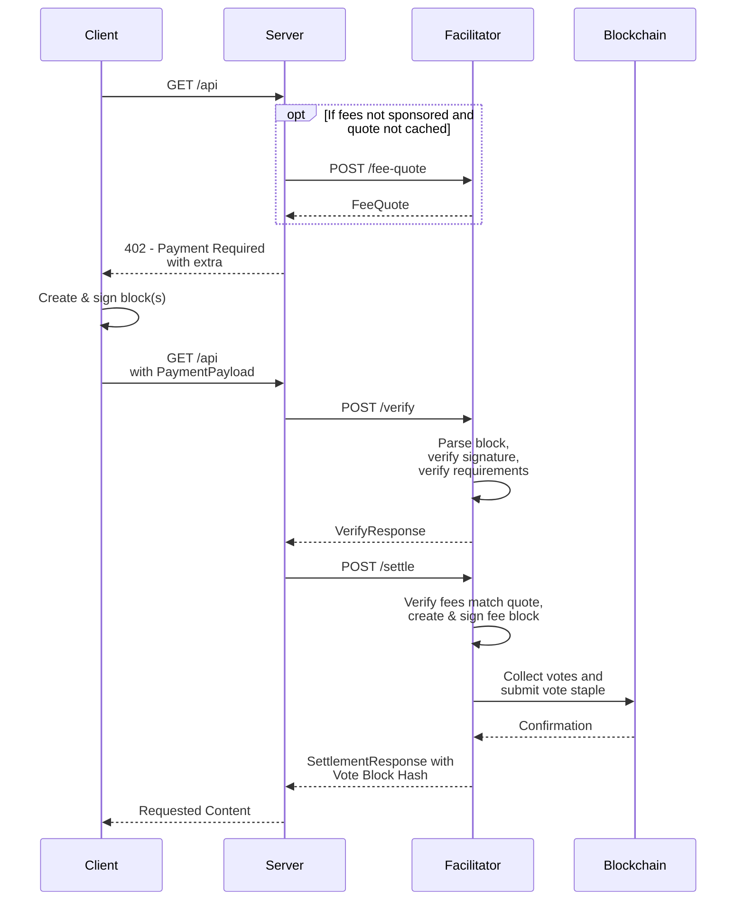

# Scheme: `exact` on `keeta`

## Summary

The `exact` scheme on Keeta transfers a specific amount of a token (such as USDC) on the Keeta network from the payer to the resource server.
The payer constructs a signed block containing the operations to fulfill the `paymentRequirements` and, if fee sponsorship is disabled, pay the fees as quoted by the facilitator.
The facilitator can validate and submit the signed block to the blockchain but cannot alter it to redirect funds to any other address.

**Version Support:** This specification supports x402 v2 protocol only.

## Protocol



1.  **Client** makes a request to a **Resource Server**.
2.  If fees are not sponsored (as indicated by the `extra.feeSponsored` field in the `/supported` endpoint of the facilitator), the **Resource Server** queries the **Facilitator's** [`/fee-quote` endpoint](#fee-quote-endpoint) to obtain a fee quote (or uses a cached quote that has not expired).
3.  **Resource Server** responds with a payment required signal containing `PaymentRequired`. If fees are not sponsored, the `extra.feeQuote` field is set to the facilitator's fee quote. Otherwise `extra.feeQuote` is unset.
4.  **Client** creates and signs a block with a `SEND` operation to transfer the specified amount of the token to the recipient. If the `extra.external` field is set, the client sets the `external` field to the specified value in the `SEND` operation. If `extra.feeQuote` is set, the client also adds a `SEND` operation to transfer `feeQuote.amount` of `feeQuote.token` to the `feeQuote.feePayer` address. The block is **not** published to the network. If `extra.supportsAdditionalOperations` is `true`, the client may add additional operations to the block and may include additional signed blocks in the payload.
5.  **Client** serializes the signed block (and any additional blocks) into their ASN.1 DER representation and encodes them as Base64 strings.
6.  **Client** sends a new request to the **Resource Server** with the `PaymentPayload` containing the Base64-encoded signed block(s).
7.  **Resource Server** receives the request and forwards the `PaymentPayload` and `PaymentRequirements` to a **Facilitator's** `/verify` endpoint.
8. **Facilitator** decodes and parses the signed block(s) and verifies the block according to the [verification rules](#verification).
9. **Facilitator** returns a `VerifyResponse` to the **Resource Server**.
10. **Resource Server**, upon successful verification, forwards the payload to the facilitator's `/settle` endpoint.
11. **Facilitator** verifies the block according to the [settlement rules](#settlement). It computes and signs a fee block as the `feeQuote.feePayer` to pay for the fees, requests votes for the blocks (including any additional blocks) from the network's representatives and publishes the combined vote staple to the network.
12. Upon successful on-chain settlement, the **Facilitator** responds with a `SettlementResponse` including the hash of the vote staple to the **Resource Server**.
13. **Resource Server** grants the **Client** access to the resource in its response.

### Fee Sponsorship

The facilitator advertises whether it sponsors network fees via `extra.feeSponsored` in its `/supported` endpoint.

When fees are sponsored, `extra.feeQuote` is unset and the client does not include a `SEND` operation to pay fees.

When fees are not sponsored, the server obtains a fee quote from the facilitator and includes it as `extra.feeQuote`. The client must include a `SEND` operation to pay `feeQuote.amount` of `feeQuote.token` to the `feeQuote.feePayer` address.

## Fee Quote Endpoint

Representatives in the Keeta network have a flexible fee structure where each independently defines the fee token and amount they require.
Because the facilitator may use different representatives than the client would, a client querying the network directly could see different fee amounts or tokens than what the facilitator actually needs.
The fee quote endpoint solves this by having the facilitator declare exactly the fees it expects and letting them handle potential fee token conversions independently from the client.

When `feeSponsored` is `false`, the resource server must obtain a fee quote from the facilitator before responding to clients with payment requirements.

### Request

`POST /fee-quote`

**Request Body:**

```json
{
  "network": "keeta:21378"
}
```

**Field Descriptions:**

- `network`: CAIP-2 network identifier, e.g. `keeta:21378` (mainnet) or `keeta:1413829460` (testnet)

### Response

```json
{
  "id": "8d6b07bb-b640-4621-801b-fcd6d4320b2d",
  "network": "keeta:21378",
  "feePayer": "keeta_aa5432zyxwvutsrqponmlkjihgfedcba765432zyxwvutsrqponmlkjihgfedcb",
  "amount": "8160000000000000",
  "token": "keeta_anqdilpazdekdu4acw65fj7smltcp26wbrildkqtszqvverljpwpezmd44ssg",
  "expiry": "2026-02-26T12:00:00Z",
  "signature": "base64..."
}
```

**Field Descriptions:**

- `id`: Random unique identifier for this quote (e.g., a UUID v4)
- `network`: CAIP-2 network identifier the quote is valid for (e.g., `keeta:21378`)
- `feePayer`: Base32-encoded public key of the fee recipient account
- `token`: Base32-encoded identifier public key of the fee token
- `amount`: Fee amount in atomic units of the given `token` (e.g. `"8160000000000000"` = 0.00816 KTA since KTA has 18 decimals on mainnet)
- `expiry`: ISO 8601 timestamp when the quote expires (e.g., `"2026-02-26T12:00:00Z"`)
- `signature`: Base64-encoded signature over the quote, created with the `feePayer` private key

### Signature

The signature is computed over the canonical JSON serialization of the quote fields (excluding the `signature`).
The canonical form is a JSON object with keys sorted alphabetically and serialized with no extra whitespace:

```json
{"amount":"...","expiry":"...","feePayer":"...","id":"...","network":"...","token":"..."}
```

The facilitator signs the UTF-8 encoded bytes of this string using their private key (e.g. the one corresponding to `feePayer`) and Base64-encodes the resulting signature.

The server may cache quotes according to `expiry`.
The entire quote object is forwarded to clients via `extra.feeQuote` and passed back through the payment flow so the facilitator can verify the signature at verification time.

## Payment header payload

### `PaymentRequirements` for `exact`

In addition to the standard x402 `PaymentRequirements` fields, the `exact` scheme on Keeta supports several `extra` fields:

```json
{
  "scheme": "exact",
  "network": "keeta:21378",
  "amount": "1000000",
  "asset": "keeta_amnkge74xitii5dsobstldatv3irmyimujfjotftx7plaaaseam4bntb7wnna",
  "payTo": "keeta_aabcdefghijklmnopqrstuvwxyz234567abcdefghijklmnopqrstuvwxyz2345",
  "maxTimeoutSeconds": 60,
  "extra": {
    "feeQuote": {
      "id": "8d6b07bb-b640-4621-801b-fcd6d4320b2d",
      "network": "keeta:21378",
      "feePayer": "keeta_aa5432zyxwvutsrqponmlkjihgfedcba765432zyxwvutsrqponmlkjihgfedcb",
      "amount": "8160000000000000",
      "token": "keeta_anqdilpazdekdu4acw65fj7smltcp26wbrildkqtszqvverljpwpezmd44ssg",
      "expiry": "2026-02-26T12:00:00Z",
      "signature": "base64..."
    },
    "external": "0123456789abcdef0123456789abcdef",
    "supportsAdditionalOperations": true
  }
}
```

**Field Descriptions:**

- `scheme`: Always `"exact"` for this scheme
- `network`: CAIP-2 network identifier, e.g. `keeta:21378` (mainnet) or `keeta:1413829460` (testnet)
- `amount`: The exact amount to transfer in atomic units (e.g., `"1000000"` = 1 USDC, since USDC has 6 decimals)
- `asset`: The Base32-encoded identifier public key of the token (e.g., USDC on Keeta mainnet: `keeta_amnkge74xitii5dsobstldatv3irmyimujfjotftx7plaaaseam4bntb7wnna`)
- `payTo`: The Base32-encoded public key of the recipient account
- `maxTimeoutSeconds`: Maximum time in seconds before the payment expires
- `extra.feeQuote`: **Optional**. Present when fees are not sponsored. Contains the facilitator's fee quote as returned by the [`/fee-quote` endpoint](#fee-quote-endpoint). The client uses `feeQuote.feePayer`, `feeQuote.amount`, and `feeQuote.token` to construct the fee `SEND` operation.
- `extra.external`: **Optional**. `external` reference the client should set in the `SEND` operation to the `payTo` address (see [Keeta docs](https://static.network.keeta.com/docs/classes/KeetaNetSDK.Referenced.BlockOperationSEND.html#external)). This is especially useful for resource servers to automatically off-ramp received payments to a bank account or bridge them to a different chain via asset movement anchors.
- `extra.supportsAdditionalOperations`: **Optional**. When `true`, the client may add additional operations to the payment block and may include additional signed blocks in the payload.

### PaymentPayload `payload` Field

The `payload` field of the `PaymentPayload` must contain the following fields:

- `block`: Base64 encoded ASN.1 DER-serialized signed block which contains a `SEND` operation to pay the requested amount of a token and, if `extra.feeQuote` is set, a `SEND` operation to pay `feeQuote.amount` of `feeQuote.token` to `feeQuote.feePayer`.
- `additionalBlocks`: **Optional**. Only permitted when `extra.supportsAdditionalOperations` is `true`. An array of Base64-encoded ASN.1 DER-serialized signed blocks to be published alongside the payment block. Clients may want to set this to chain additional operations (e.g. token swaps) directly to the payment block in the same vote staple. This eliminates the need to wait for payment confirmation before separately publishing and waiting for the additional blocks.

Example `payload`:

```json
{
  "block":"MIH6AgEAAgRURVNUBQAYEzIwMjYwMTIzMjIyNjUwLjczMFoEIgAC2Ynov21UzUtAf00BzdTbpJCJl1DuLlX4mAiKHx57uQAFAAQgmArjQZymslS0VvBMCNyicKkDyDUqoMQIfU8nl82JcvAwTqBMMEoEIgADEFUSmawYqevhKALRFALRYRGGrXR20+JHvI/5oE8qz00CAQEEIQNwgpeV3wC60ZR4DMHh0sDJDXFi4Mhesi9jMHvtPqp1SgRAdoNTNrjabm2gJBT2yAtVniYlpU4AzWZxb6b7rfMSw/d+C09d5qI6NmS1U2o+cOt+yJLEYE2qCEsKBYdHrgkwNA==",
  "additionalBlocks": []
}
```

Full `PaymentPayload` object:

```json
{
  "x402Version": 2,
  "resource": {
    "url": "https://example.com/weather",
    "description": "Access to protected content",
    "mimeType": "application/json"
  },
  "accepted": {
    "scheme": "exact",
    "network": "keeta:1413829460",
    "amount": "1000000000",
    "asset": "keeta_anyiff4v34alvumupagmdyosydeq24lc4def5mrpmmyhx3j6vj2uucckeqn52",
    "payTo": "keeta_aabravistgwbrkpl4euafuiualiwcemgvv2hnu7ci66i76naj4vm6tmeahmzria",
    "maxTimeoutSeconds": 60,
    "extra": {
      "feeQuote": {
        "id": "8d6b07bb-b640-4621-801b-fcd6d4320b2d",
        "network": "keeta:1413829460",
        "feePayer": "keeta_aa5432zyxwvutsrqponmlkjihgfedcba765432zyxwvutsrqponmlkjihgfedcb",
        "amount": "8160000",
        "token": "keeta_anyiff4v34alvumupagmdyosydeq24lc4def5mrpmmyhx3j6vj2uucckeqn52",
        "expiry": "2026-02-26T12:00:00Z",
        "signature": "base64..."
      },
      "supportsAdditionalOperations": true
    }
  },
  "payload": {
    "block":"MIH6AgEAAgRURVNUBQAYEzIwMjYwMTIzMjIyNjUwLjczMFoEIgAC2Ynov21UzUtAf00BzdTbpJCJl1DuLlX4mAiKHx57uQAFAAQgmArjQZymslS0VvBMCNyicKkDyDUqoMQIfU8nl82JcvAwTqBMMEoEIgADEFUSmawYqevhKALRFALRYRGGrXR20+JHvI/5oE8qz00CAQEEIQNwgpeV3wC60ZR4DMHh0sDJDXFi4Mhesi9jMHvtPqp1SgRAdoNTNrjabm2gJBT2yAtVniYlpU4AzWZxb6b7rfMSw/d+C09d5qI6NmS1U2o+cOt+yJLEYE2qCEsKBYdHrgkwNA==",
    "additionalBlocks": []
  }
}
```

## Verification

Steps to verify a payment for the `exact` scheme on Keeta:

1. Verify `x402Version` is `2`.
2. Verify the network matches the agreed upon chain (CAIP-2 format: `keeta:<network_id>`).
3. Verify that `extra.supportsAdditionalOperations` matches the facilitator's configuration.
4. Verify that the `extra.feeQuote` field matches the facilitator's configuration:
    1. If `extra.feeQuote` is unset, verify that the facilitator supports fee sponsoring.
    2. If `extra.feeQuote` is set:
        - Verify the `feeQuote.signature` to ensure the quote originated from the facilitator.
        - Verify that `feeQuote.expiry` has not passed.
5. Decode and deserialize the Base64 and ASN.1 DER-encoded `payload.block` and:
    1. Verify that the signature is valid.
    2. Verify that the `network` matches the agreed upon Keeta `network_id`.
    3. Verify the operation count:
        - If `extra.feeQuote` is unset and `extra.supportsAdditionalOperations` is `false`: exactly one operation.
        - If `extra.feeQuote` is set and `extra.supportsAdditionalOperations` is `false`: exactly two operations.
        - If `extra.supportsAdditionalOperations` is `true`: at least the required number of operations above but additional operations are permitted.
    4. Verify that the first operation in `operations` is a `SEND` operation to pay the server for which:
        - The `token` matches the `requirements.asset`.
        - The `amount` matches the `requirements.amount`.
        - The `to` matches the `requirements.payTo`.
        - The `external` matches the `extra.external` if set.
    5. If `extra.feeQuote` is set, verify that the operation following the payment `SEND` is a `SEND` operation to pay the quoted fees for which:
        - The `to` matches `feeQuote.feePayer` and is one of the facilitator's own addresses.
        - The `token` matches `feeQuote.token`.
        - The `amount` matches `feeQuote.amount`.
6. If `payload.additionalBlocks` is present:
    1. Verify that `extra.supportsAdditionalOperations` is `true`.
    2. For each additional block, decode and deserialize the Base64 and ASN.1 DER-encoded block and verify that the signature is valid.

## Settlement

Settlement is performed through the facilitator:

1. **Facilitator** receives the `block` (and `additionalBlocks` if present).
2. **Facilitator** computes and signs a fee block.
3. **Facilitator** transmits the blocks (including additional blocks if enabled) to the network by requesting the votes from the representatives and publishing the combined vote staple to the network.
4. **Facilitator** sends the `SettlementResponse` to the **Resource Server**.

### `SettlementResponse`

The `SettlementResponse` for the exact scheme on Keeta:

```json
{
  "success": true,
  "transaction": "426C2D7401BB49D78F1C1EA84BF4AD7EBE294C4758037507AADD12CC0AB62910",
  "network": "keeta:1413829460",
  "payer": "keeta_aabntcpix5wvjtklib7u2aon2tn2jeejs5io4lsv7cmarcq7dz53sahhsuapica"
}
```

**Field Descriptions:**

- `transaction`: The [`VoteBlockHash`](https://static.network.keeta.com/docs/classes/KeetaNetSDK.Referenced.VoteBlockHash.html) of the submitted vote staple.
- `network`: CAIP-2 network identifier, e.g. `keeta:21378` (mainnet) or `keeta:1413829460` (testnet)
- `payer`: The Base32-encoded public key of the account that payed the server

## Appendix

### Transaction Serialization

The primary data structure in Keeta is a directed acyclic graph where each account basically has their own blockchain (see [Data Structure](https://docs.keeta.com/architecture/data-structure) for more information).
Since the facilitator handles the fee payment (either sponsored or forwarded from the client), they have to serialize the transactions they settle on the chain to avoid any locks from trying to submit multiple vote staples at the same time.

### Multiple Facilitator Accounts

To avoid congestion from [Transaction Serialization](#transaction-serialization) on a single account of the facilitator they may use multiple `feePayer` accounts to settle the transactions as follow:

- When fees are sponsored, the facilitator may load-balance on a per-request basis to decide which account to use to settle the transaction.
- When fees are not sponsored, the facilitator may load-balance on a per-server basis by assigning `feePayer` addresses randomly to resource servers when they discover the facilitator's capabilities. The resource servers would then forward these to the clients when a payment is required.
