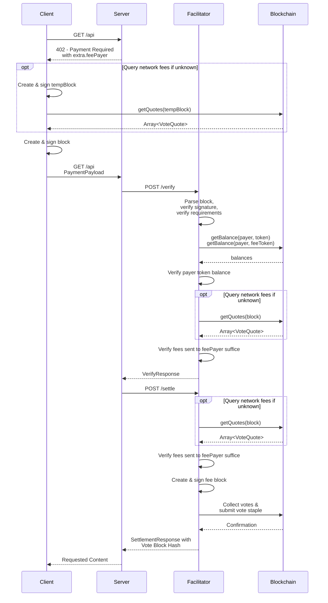

# Scheme: `exact` on `keeta`

## Summary

The `exact` scheme on Keeta transfers a specific amount of a token (such as USDC) on the Keeta network from the payer to the resource server.
The payer constructs signed blocks containing the operations to fulfill the `paymentRequirements` and pay for the network's fees.
The facilitator can validate and submit the signed blocks to the blockchain but not alter them to redirect funds to any other address.

**Version Support:** This specification supports x402 v2 protocol only.

## Protocol



1.  **Client** makes a request to a **Resource Server**.
2.  **Resource Server** responds with a payment required signal containing `PaymentRequired` and the `extra.feePayer` set to the account address of the entity that will pay the fee for the transaction, typically the facilitator.
3.  **Client** creates and signs a block with a `SEND` operation to transfer the specified amount of the token to the recipient and a `SEND` operation to transfer the network's fees to the `feePayer`. The block is **not** published to the network. Optionally, if the client doesn't know the required fees for the transaction, it may request vote quotes from the network's representatives to send the expected amount of fees.
4.  **Client** serializes the signed blocks into their ASN.1 DER representation and encodes them as a Base64 string.
5.  **Client** sends a new request to the **Resource Server** with the `PaymentPayload` containing the Base64-encoded signed blocks.
6.  **Resource Server** receives the request and forwards the `PaymentPayload` and `PaymentRequirements` to a **Facilitator Server's** `/verify` endpoint.
7.  **Facilitator** decodes and parses the signed blocks, verifies their signature, and ensures that they contain only the expected operations.
8. **Facilitator** looks up the payer's balance of the token to pay and the fee token and ensures they have enough to complete the transaction.
10. **Facilitator** returns a `VerifyResponse` to the **Resource Server**.
11. **Resource Server**, upon successful verification, forwards the payload to the facilitator's `/settle` endpoint.
12. **Facilitator Server** verifies that the block contains a `SEND` operation to the `feePayer` (itself) which matches the at least the required fees for the network (e.g. by requesting quotes from the representatives), computes and signs a fee block as the `feePayer` to pay for the fees, requests votes for the blocks from the network's representatives and publishes the combined vote staple to the network.
13. Upon successful on-chain settlement, the **Facilitator Server** responds with a `SettlementResponse` including the hash of the vote staple to the **Resource Server**.
14. **Resource Server** grants the **Client** access to the resource in its response.

## Payment header payload

### `PaymentRequirements` for `exact`

In addition to the standard x402 `PaymentRequirements` fields, the `exact` scheme on Keeta requires the additional `extra.feePayer` field:

```json
{
  "scheme": "exact",
  "network": "keeta:21378",
  "amount": "1000000",
  "asset": "keeta_amnkge74xitii5dsobstldatv3irmyimujfjotftx7plaaaseam4bntb7wnna",
  "payTo": "keeta_aabcdefghijklmnopqrstuvwxyz234567abcdefghijklmnopqrstuvwxyz2345",
  "maxTimeoutSeconds": 60,
  "extra": {
    "feePayer": "keeta_aa5432zyxwvutsrqponmlkjihgfedcba765432zyxwvutsrqponmlkjihgfedcb"
  }
}
```

**Field Descriptions:**

- `scheme`: Always `"exact"` for this scheme
- `network`: CAIP-2 network identifier, e.g. `keeta:21378` (mainnet) or `keeta:1413829460` (testnet)
- `amount`: The exact amount to transfer in atomic units (e.g., `"1000000"` = 1 USDC, since USDC has 6 decimals)
- `asset`: The base32-encoded identifier public key of the token (e.g., USDC on Keeta mainnet: `keeta_amnkge74xitii5dsobstldatv3irmyimujfjotftx7plaaaseam4bntb7wnna`)
- `payTo`: The base32-encoded public key of the recipient account
- `maxTimeoutSeconds`: Maximum time in seconds before the payment expires
- `extra.feePayer`: The base32-encoded public key of the account which pays the fees, typically the facilitator

### PaymentPayload `payload` Field

The `payload` field of the `PaymentPayload` must contain the following fields:

- `block`: Base64 encoded ASN.1 DER-serialized signed block which contains a `SEND` operation to pay the requested amount of a token and a `SEND` operation to pay the fees to the `feePayer`

Example `payload`:

```json
{
  "block":"MIH6AgEAAgRURVNUBQAYEzIwMjYwMTIzMjIyNjUwLjczMFoEIgAC2Ynov21UzUtAf00BzdTbpJCJl1DuLlX4mAiKHx57uQAFAAQgmArjQZymslS0VvBMCNyicKkDyDUqoMQIfU8nl82JcvAwTqBMMEoEIgADEFUSmawYqevhKALRFALRYRGGrXR20+JHvI/5oE8qz00CAQEEIQNwgpeV3wC60ZR4DMHh0sDJDXFi4Mhesi9jMHvtPqp1SgRAdoNTNrjabm2gJBT2yAtVniYlpU4AzWZxb6b7rfMSw/d+C09d5qI6NmS1U2o+cOt+yJLEYE2qCEsKBYdHrgkwNA=="
}
```

Full `PaymentPayload` object:

```json
{
  "x402Version": 2,
  "resource": {
    "url": "https://example.com/weather",
    "description": "Access to protected content",
    "mimeType": "application/json"
  },
  "accepted": {
    "scheme": "exact",
    "network": "keeta:1413829460",
    "amount": "1000000000",
    "asset": "keeta_anyiff4v34alvumupagmdyosydeq24lc4def5mrpmmyhx3j6vj2uucckeqn52",
    "payTo": "keeta_aabravistgwbrkpl4euafuiualiwcemgvv2hnu7ci66i76naj4vm6tmeahmzria",
    "maxTimeoutSeconds": 60,
    "extra": {
      "feePayer": "keeta_aa5432zyxwvutsrqponmlkjihgfedcba765432zyxwvutsrqponmlkjihgfedcb"
    }
  },
  "payload": {
    "block":"MIH6AgEAAgRURVNUBQAYEzIwMjYwMTIzMjIyNjUwLjczMFoEIgAC2Ynov21UzUtAf00BzdTbpJCJl1DuLlX4mAiKHx57uQAFAAQgmArjQZymslS0VvBMCNyicKkDyDUqoMQIfU8nl82JcvAwTqBMMEoEIgADEFUSmawYqevhKALRFALRYRGGrXR20+JHvI/5oE8qz00CAQEEIQNwgpeV3wC60ZR4DMHh0sDJDXFi4Mhesi9jMHvtPqp1SgRAdoNTNrjabm2gJBT2yAtVniYlpU4AzWZxb6b7rfMSw/d+C09d5qI6NmS1U2o+cOt+yJLEYE2qCEsKBYdHrgkwNA=="
  }
}
```

## Verification

Steps to verify a payment for the `exact` scheme on Keeta:

1. Verify `x402Version` is `2`.
2. Verify the network matches the agreed upon chain (CAIP-2 format: `keeta:<network_id>`).
3. Decode and deserialize the Base64 and ASN.1 DER-encoded `payload.block` and:
  1. Verify that the signature is valid 
  2. Verify that the `network` matches the agreed upon Keeta `network_id`
  3. Verify that the `operations` contain exactly two `SEND` operation:
    1. The payment operation for which:
      - The `token` matches the `requirements.asset`
      - The `amount` matches the `requirements.amount`
      - The `to` matches the `requirements.payTo`
    2. The fee operation for which:
      - The `token` matches the network's fee token
      - The `amount` matches at least the network's required fee amount for submitting the block
      - The `to` matches the `extra.feePayer` and it's own address
  4. Verify that the block's `account` has sufficient funds of the `token` to send the `requirements.amount` and sufficient funds of the fee token to send the fee amount.

## Settlement

Settlement is performed through the facilitator:

1. **Facilitator** receives the `block`.
2. **Facilitator** ensures that the block contains a `SEND` operation which sends at least the network's required funds to it's own address.
2. **Facilitator** computes and signs a fee block and transmits the blocks to the network by requesting the votes from the representatives and publishing the combined vote staple to the network.
3. **Facilitator** sends the `SettlementResponse` to the **Resource Server**

### `SettlementResponse`

The `SettlementResponse` for the exact scheme on Keeta:

```json
{
  "success": true,
  "transaction": "426C2D7401BB49D78F1C1EA84BF4AD7EBE294C4758037507AADD12CC0AB62910",
  "network": "keeta:1413829460",
  "payer": "keeta_aabntcpix5wvjtklib7u2aon2tn2jeejs5io4lsv7cmarcq7dz53sahhsuapica"
}
```

**Field Descriptions:**

- `transaction`: The [`VoteBlockHash`](https://static.network.keeta.com/docs/classes/KeetaNetSDK.Referenced.VoteBlockHash.html) of the submitted vote staple.
- `network`: CAIP-2 network identifier, e.g. `keeta:21378` (mainnet) or `keeta:1413829460` (testnet)
- `payer`: The base32-encoded public key of the sender account

## Appendix
