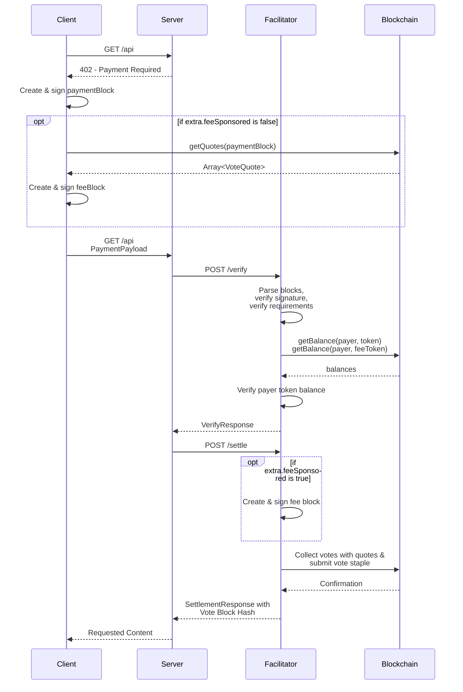

# Scheme: `exact` on `keeta`

## Summary

The `exact` scheme on Keeta transfers a specific amount of a token (such as USDC) on the Keeta network from the payer to the resource server.
The payer constructs signed blocks containing the operations to fulfill the `paymentRequirements` and pay for the network's fees.
The facilitator can validate and submit the signed blocks to the blockchain but not alter them to redirect funds to any other address.

**Version Support:** This specification supports x402 v2 protocol only.

## Protocol



1.  **Client** makes a request to a **Resource Server**.
2.  **Resource Server** responds with a payment required signal containing `PaymentRequired`.
3.  **Client** creates and signs blocks. The blocks are **not** published to the network.
    - One with a `SEND` operation to transfer the specified amount of the token to the recipient. If the `extra.external` field is set, the client sets the `external` field to the specified value in the `SEND` operation.
    - If `extra.feeSponsored` is `false`, it requests vote quotes from the network's representatives and creates a `Fee` block to pay for the network's fee.
4.  **Client** serializes the signed blocks into their ASN.1 DER representation and encodes them as a Base64 string. If `extra.feeSponsored` is `false`, it also serializes the quotes into their ASN.1 DER representation and encodes them as a Base64 string.
5.  **Client** sends a new request to the **Resource Server** with the `PaymentPayload` containing the Base64-encoded signed blocks.
6.  **Resource Server** receives the request and forwards the `PaymentPayload` and `PaymentRequirements` to a **Facilitator Server's** `/verify` endpoint.
7.  **Facilitator** decodes and parses the signed blocks and verifies them according to the [verification rules](#verification).
8. **Facilitator** looks up the payer's balance of the token to pay and ensures they have enough to complete the transaction. If `extra.feeSponsored` is `false`, it also ensures that the payer has enough balance to pay the network's fees.
9. **Facilitator** returns a `VerifyResponse` to the **Resource Server**.
10. **Resource Server**, upon successful verification, forwards the payload to the facilitator's `/settle` endpoint.
11. **Facilitator** verifies the block according to the [settlement rules](#settlement). 
12. If `extra.feeSponsored` is `false`, the **Facilitator** creates and signs a `Fee` block.
13. **Facilitator** requests votes for the payment and fee blocks from the network's representatives and publishes the combined vote staple to the Keeta network.
14. Upon successful on-chain settlement, the **Facilitator** responds with a `SettlementResponse` including the hash of the vote staple to the **Resource Server**.
15. **Resource Server** grants the **Client** access to the resource in its response.

### Fee Sponsorship

The facilitator may support sponsorship of the network fees which the client determines via the `extra.feeSponsored` field (see [Payment header payload](#payment-header-payload)).
In that case, the client doesn't have to query the network's fees and doesn't include a `Fee` block.

## Payment header payload

### `PaymentRequirements` for `exact`

In addition to the standard x402 `PaymentRequirements` fields, the `exact` scheme on Keeta supports several `extra` fields:

```json
{
  "scheme": "exact",
  "network": "keeta:21378",
  "amount": "1000000",
  "asset": "keeta_amnkge74xitii5dsobstldatv3irmyimujfjotftx7plaaaseam4bntb7wnna",
  "payTo": "keeta_aabcdefghijklmnopqrstuvwxyz234567abcdefghijklmnopqrstuvwxyz2345",
  "maxTimeoutSeconds": 60,
  "extra": {
    "feeSponsored": false,
    "external": "0123456789abcdef0123456789abcdef"
  }
}
```

**Field Descriptions:**

- `scheme`: Always `"exact"` for this scheme
- `network`: CAIP-2 network identifier, e.g. `keeta:21378` (mainnet) or `keeta:1413829460` (testnet)
- `amount`: The exact amount to transfer in atomic units (e.g., `"1000000"` = 1 USDC, since USDC has 6 decimals)
- `asset`: The base32-encoded identifier public key of the token (e.g., USDC on Keeta mainnet: `keeta_amnkge74xitii5dsobstldatv3irmyimujfjotftx7plaaaseam4bntb7wnna`)
- `payTo`: The base32-encoded public key of the recipient account
- `maxTimeoutSeconds`: Maximum time in seconds before the payment expires
- `extra.feeSponsored`: Whether the network's fee is sponsored by the facilitator.
- `extra.external`: **Optional**. `external` reference the client should set in the `SEND` operation to the `payTo` address (see [Keeta docs](https://static.network.keeta.com/docs/classes/KeetaNetSDK.Referenced.BlockOperationSEND.html#external))

### PaymentPayload `payload` Field

The `payload` field of the `PaymentPayload` must contain the following fields:

- `paymentBlock`: Base64 encoded ASN.1 DER-serialized signed block which contains the `SEND` operation to pay the requested amount of a token
-  If `extra.feeSponsored` is `false`:
    - `feeBlock`: Base64 encoded ASN.1 DER-serialized signed fee block which contains the `SEND` operations to pay the network's fees.
    - `quotes`: An array of Base64 encoded ASN.1 DER-serialized [vote quotes](https://static.network.keeta.com/docs/classes/KeetaNetSDK.Referenced.VoteQuote.html) the client received from the representatives when creating the fee block.

Example `payload`:

```json
{
  "paymentBlock":"MIH6AgEAAgRURVNUBQAYEzIwMjYwMTIzMjIyNjUwLjczMFoEIgAC2Ynov21UzUtAf00BzdTbpJCJl1DuLlX4mAiKHx57uQAFAAQgmArjQZymslS0VvBMCNyicKkDyDUqoMQIfU8nl82JcvAwTqBMMEoEIgADEFUSmawYqevhKALRFALRYRGGrXR20+JHvI/5oE8qz00CAQEEIQNwgpeV3wC60ZR4DMHh0sDJDXFi4Mhesi9jMHvtPqp1SgRAdoNTNrjabm2gJBT2yAtVniYlpU4AzWZxb6b7rfMSw/d+C09d5qI6NmS1U2o+cOt+yJLEYE2qCEsKBYdHrgkwNA==",
  "feeBlock":"oYIB7DCCAegCBFRFU1QYEzIwMjYwMTIzMjIyNjUxLjE1M1oCAQEEIgAC2Ynov21UzUtAf00BzdTbpJCJl1DuLlX4mAiKHx57uQAFAAQg+Jj2V0VYWBEA6ZTknlFtP0QLHESxOv/stMbakI5pnXMwggE8oE0wSwQiAAOfKFQiMGWDnfri6PFAwR16wvqYpDdT/WMpDxCnkhcQ3wICJ3QEIQNwgpeV3wC60ZR4DMHh0sDJDXFi4Mhesi9jMHvtPqp1SqBNMEsEIgADxDGirio74X4qmOh51l2gsYMdzcB828pjNDQN6ZmqTHQCAid0BCEDcIKXld8AutGUeAzB4dLAyQ1xYuDIXrIvYzB77T6qdUqgTTBLBCIAAxq+UlBkMMnzbtqhNSr0kS3nP20+T03EIbc3WP+KkA9DAgIndAQhA3CCl5XfALrRlHgMweHSwMkNcWLgyF6yL2Mwe+0+qnVKoE0wSwQiAALsqdLTjf4pCAmvvdVwqbhKLbsivMqVY0s7IA4Tp/sSoAICJ3QEIQNwgpeV3wC60ZR4DMHh0sDJDXFi4Mhesi9jMHvtPqp1SgRAkcm6DfcJ72x03mkWJzvEECiDmCuu/A1FgO6fke2jMFNAXBzKs54t9THBfbnOZsecIApv952gEWM/NwfBAKO3nQ==",
  "quotes":[
    "MIIByjCCAXCgAwIBAgIEA91mDjALBglghkgBZQMEAwowUDFOMEwGA1UEAwxFa2VldGFfYWFiaTRiZDNmN2pydDY3bXhjcTQ0b3pqNjViaDRicDJteWdtcmtlZHhnZ3Uycnh3bjJ6dHV3M2I2ZXhpdmJxMCoYEzIwMjYwMTIzMjIyNjUwLjg1OFoYEzIwMjYwMTIzMjIzMTUwLjg1N1owEjEQMA4GA1UEBQwHM2RkNjYwZTA2MBAGByqGSM49AgEGBSuBBAAKAyIAAo4Eey/TGfvsuKHOOyn3Qn4F+mYMyKiDuY1NRvZuszpbo4GLMIGIMEMGCWCGSAFlAwMBAwEB/wQzoDEwLwYJYIZIAWUDBAIIMCIEIPiY9ldFWFgRAOmU5J5RbT9ECxxEsTr/7LTG2pCOaZ1zMEEGCysGAQQBg+lTAAEAAQH/BC+gLTArAQH/AgIndIAiAAOfKFQiMGWDnfri6PFAwR16wvqYpDdT/WMpDxCnkhcQ3zALBglghkgBZQMEAwoDRwAwRAIgUcAUWVJhAn/1VCl7jXSL27vzGvyowLNZ7IQ5tlJ7Or0CIELB3kAbQ6JsOsNBteLx0Z1r9xaLdds1hb05PmVRee85",
    "MIIByjCCAXCgAwIBAgIEBVDfRDALBglghkgBZQMEAwowUDFOMEwGA1UEAwxFa2VldGFfYWFiZjdkejVhc3EybjJscmxkY3QzM3gyd3c2NWNvcGh4cDdlZ2ZpaXhiYjd0YnlhdDVyM2tjYmNlejdmdHBpMCoYEzIwMjYwMTIzMjIyNjUwLjkxN1oYEzIwMjYwMTIzMjIzMTUwLjkxN1owEjEQMA4GA1UEBQwHNTUwZGY0NDA2MBAGByqGSM49AgEGBSuBBAAKAyIAAl+PPQShpulxWMU97vq1vdE557v+QxUIuEP5hwCfY7UIo4GLMIGIMEMGCWCGSAFlAwMBAwEB/wQzoDEwLwYJYIZIAWUDBAIIMCIEIPiY9ldFWFgRAOmU5J5RbT9ECxxEsTr/7LTG2pCOaZ1zMEEGCysGAQQBg+lTAAEAAQH/BC+gLTArAQH/AgIndIAiAAPEMaKuKjvhfiqY6HnWXaCxgx3NwHzbymM0NA3pmapMdDALBglghkgBZQMEAwoDRwAwRAIgJe9T9bdglomOn7Gy3bM/cMb9Ux96f0x2hlztN1jZ/iwCIF/QJe8W1D8sTuoygWMw7yHT4HyXY07G7/tbzEPTBUkB",
    "MIIByzCCAXCgAwIBAgIEA+GQzjALBglghkgBZQMEAwowUDFOMEwGA1UEAwxFa2VldGFfYWFiM2N4ZWdpendodGltM3pseXV3amhpcWQ1aWtraHhnNDJzbWh3YzN3eDZ5bjdlcDJ0Nmx3bzZlbXZ3NHdhMCoYEzIwMjYwMTIzMjIyNjUxLjA0NloYEzIwMjYwMTIzMjIzMTUxLjA0NlowEjEQMA4GA1UEBQwHM2UxOTBjZTA2MBAGByqGSM49AgEGBSuBBAAKAyIAA7FchkZseaGbyvFLJOiA+oUo9zc1Jh7C3a/sN+R+p+XZo4GLMIGIMEMGCWCGSAFlAwMBAwEB/wQzoDEwLwYJYIZIAWUDBAIIMCIEIPiY9ldFWFgRAOmU5J5RbT9ECxxEsTr/7LTG2pCOaZ1zMEEGCysGAQQBg+lTAAEAAQH/BC+gLTArAQH/AgIndIAiAAMavlJQZDDJ827aoTUq9JEt5z9tPk9NxCG3N1j/ipAPQzALBglghkgBZQMEAwoDSAAwRQIhAKYnwZVElqs6qhNqZuHQhZ8Roi0RZFJw5dlWuZKnRTDrAiBcoDTYS5SBaBB1Z55xjhS4PF8MSaDfZux6xf/sqMdMXA==",
    "MIIByzCCAXCgAwIBAgIEAxBLkDALBglghkgBZQMEAwowUDFOMEwGA1UEAwxFa2VldGFfYWFiem5vaWNyenZ0ZTZxbDVyeGJndWdtZnJqcXViYm5qdW81bDZpdm9wb3d5NHJwa3FnczVmY28zb2FlemNxMCoYEzIwMjYwMTIzMjIyNjUwLjk3MFoYEzIwMjYwMTIzMjIzMTUwLjk3MFowEjEQMA4GA1UEBQwHMzEwNGI5MDA2MBAGByqGSM49AgEGBSuBBAAKAyIAA5a5Ao5rMnoL7G4TUMwsUwoELU0d1fkVc91sci9UDS6Uo4GLMIGIMEMGCWCGSAFlAwMBAwEB/wQzoDEwLwYJYIZIAWUDBAIIMCIEIPiY9ldFWFgRAOmU5J5RbT9ECxxEsTr/7LTG2pCOaZ1zMEEGCysGAQQBg+lTAAEAAQH/BC+gLTArAQH/AgIndIAiAALsqdLTjf4pCAmvvdVwqbhKLbsivMqVY0s7IA4Tp/sSoDALBglghkgBZQMEAwoDSAAwRQIhAM4NFl1OBa+NzemCJeYgvKKjF+20TCJBgck9OEXZtGC4AiBzPTzay0SWWER1srpmfVRWisNDFXF+/JnZC7p3wpHQYg=="
  ]
}
```

Full `PaymentPayload` object:

```json
{
  "x402Version": 2,
  "resource": {
    "url": "https://example.com/weather",
    "description": "Access to protected content",
    "mimeType": "application/json"
  },
  "accepted": {
    "scheme": "exact",
    "network": "keeta:1413829460",
    "amount": "1000000000",
    "asset": "keeta_anyiff4v34alvumupagmdyosydeq24lc4def5mrpmmyhx3j6vj2uucckeqn52",
    "payTo": "keeta_aabravistgwbrkpl4euafuiualiwcemgvv2hnu7ci66i76naj4vm6tmeahmzria",
    "maxTimeoutSeconds": 60,
    "extra": {
      "feeSponsored": false
    }
  },
  "payload": {
    "paymentBlock": "MIH9AgEAAgRURVNUBQAYEzIwMjYwMTIzMTkyMjQ3LjI0OFoEIgAC2Ynov21UzUtAf00BzdTbpJCJl1DuLlX4mAiKHx57uQAFAAQg7oJWfTSgOc9I7h+ePkuEiVkDJMBzma4oUygpnjrVIwIwUaBPME0EIgADEFUSmawYqevhKALRFALRYRGGrXR20+JHvI/5oE8qz00CBDuaygAEIQNwgpeV3wC60ZR4DMHh0sDJDXFi4Mhesi9jMHvtPqp1SgRA/z9zZOCZdUhoWCKCHjCamwRpnoQNFSAHEY8l2OZ2z55T7nj0yiXhL6PWIFIiqHHnvC//dugXQ7FlkIvN4QQ7+A==",
    "feeBlock": "oYIB7DCCAegCBFRFU1QYEzIwMjYwMTIzMTkyMjQ3LjY1MFoCAQEEIgAC2Ynov21UzUtAf00BzdTbpJCJl1DuLlX4mAiKHx57uQAFAAQgqe1+tClv9FrECwygWxEdx1qbdtzGfBWwbzsUCneX1PAwggE8oE0wSwQiAAOgvpZCT/jWBmPjIeKmmVGV7kuBwTssTExKeh9SIlL3sAICJ3QEIQNwgpeV3wC60ZR4DMHh0sDJDXFi4Mhesi9jMHvtPqp1SqBNMEsEIgACUTno303XiVL8VFv2h2PCS2UrbqMwmLB23pAmHY5aINwCAid0BCEDcIKXld8AutGUeAzB4dLAyQ1xYuDIXrIvYzB77T6qdUqgTTBLBCIAA90lv1xPGJkp5nS1TsgGv0q9cXMeEX4uTcBbxaNJHNhiAgIndAQhA3CCl5XfALrRlHgMweHSwMkNcWLgyF6yL2Mwe+0+qnVKoE0wSwQiAAO83grTs8q9OBnivfBFKD/ND/G7kiWLSjisVn9zgDThfQICJ3QEIQNwgpeV3wC60ZR4DMHh0sDJDXFi4Mhesi9jMHvtPqp1SgRAc3G8SqMQHrF+tDHIk5DsWEZF6qheS6t9yCLJWSYsCZV0iT8Ih4mnucr8S897mH7kFz/1vE8scp2d2XakX22wCg==",
    "quotes":[
      "MIIByjCCAXCgAwIBAgIEA91mDjALBglghkgBZQMEAwowUDFOMEwGA1UEAwxFa2VldGFfYWFiaTRiZDNmN2pydDY3bXhjcTQ0b3pqNjViaDRicDJteWdtcmtlZHhnZ3Uycnh3bjJ6dHV3M2I2ZXhpdmJxMCoYEzIwMjYwMTIzMjIyNjUwLjg1OFoYEzIwMjYwMTIzMjIzMTUwLjg1N1owEjEQMA4GA1UEBQwHM2RkNjYwZTA2MBAGByqGSM49AgEGBSuBBAAKAyIAAo4Eey/TGfvsuKHOOyn3Qn4F+mYMyKiDuY1NRvZuszpbo4GLMIGIMEMGCWCGSAFlAwMBAwEB/wQzoDEwLwYJYIZIAWUDBAIIMCIEIPiY9ldFWFgRAOmU5J5RbT9ECxxEsTr/7LTG2pCOaZ1zMEEGCysGAQQBg+lTAAEAAQH/BC+gLTArAQH/AgIndIAiAAOfKFQiMGWDnfri6PFAwR16wvqYpDdT/WMpDxCnkhcQ3zALBglghkgBZQMEAwoDRwAwRAIgUcAUWVJhAn/1VCl7jXSL27vzGvyowLNZ7IQ5tlJ7Or0CIELB3kAbQ6JsOsNBteLx0Z1r9xaLdds1hb05PmVRee85",
      "MIIByjCCAXCgAwIBAgIEBVDfRDALBglghkgBZQMEAwowUDFOMEwGA1UEAwxFa2VldGFfYWFiZjdkejVhc3EybjJscmxkY3QzM3gyd3c2NWNvcGh4cDdlZ2ZpaXhiYjd0YnlhdDVyM2tjYmNlejdmdHBpMCoYEzIwMjYwMTIzMjIyNjUwLjkxN1oYEzIwMjYwMTIzMjIzMTUwLjkxN1owEjEQMA4GA1UEBQwHNTUwZGY0NDA2MBAGByqGSM49AgEGBSuBBAAKAyIAAl+PPQShpulxWMU97vq1vdE557v+QxUIuEP5hwCfY7UIo4GLMIGIMEMGCWCGSAFlAwMBAwEB/wQzoDEwLwYJYIZIAWUDBAIIMCIEIPiY9ldFWFgRAOmU5J5RbT9ECxxEsTr/7LTG2pCOaZ1zMEEGCysGAQQBg+lTAAEAAQH/BC+gLTArAQH/AgIndIAiAAPEMaKuKjvhfiqY6HnWXaCxgx3NwHzbymM0NA3pmapMdDALBglghkgBZQMEAwoDRwAwRAIgJe9T9bdglomOn7Gy3bM/cMb9Ux96f0x2hlztN1jZ/iwCIF/QJe8W1D8sTuoygWMw7yHT4HyXY07G7/tbzEPTBUkB",
      "MIIByzCCAXCgAwIBAgIEA+GQzjALBglghkgBZQMEAwowUDFOMEwGA1UEAwxFa2VldGFfYWFiM2N4ZWdpendodGltM3pseXV3amhpcWQ1aWtraHhnNDJzbWh3YzN3eDZ5bjdlcDJ0Nmx3bzZlbXZ3NHdhMCoYEzIwMjYwMTIzMjIyNjUxLjA0NloYEzIwMjYwMTIzMjIzMTUxLjA0NlowEjEQMA4GA1UEBQwHM2UxOTBjZTA2MBAGByqGSM49AgEGBSuBBAAKAyIAA7FchkZseaGbyvFLJOiA+oUo9zc1Jh7C3a/sN+R+p+XZo4GLMIGIMEMGCWCGSAFlAwMBAwEB/wQzoDEwLwYJYIZIAWUDBAIIMCIEIPiY9ldFWFgRAOmU5J5RbT9ECxxEsTr/7LTG2pCOaZ1zMEEGCysGAQQBg+lTAAEAAQH/BC+gLTArAQH/AgIndIAiAAMavlJQZDDJ827aoTUq9JEt5z9tPk9NxCG3N1j/ipAPQzALBglghkgBZQMEAwoDSAAwRQIhAKYnwZVElqs6qhNqZuHQhZ8Roi0RZFJw5dlWuZKnRTDrAiBcoDTYS5SBaBB1Z55xjhS4PF8MSaDfZux6xf/sqMdMXA==",
      "MIIByzCCAXCgAwIBAgIEAxBLkDALBglghkgBZQMEAwowUDFOMEwGA1UEAwxFa2VldGFfYWFiem5vaWNyenZ0ZTZxbDVyeGJndWdtZnJqcXViYm5qdW81bDZpdm9wb3d5NHJwa3FnczVmY28zb2FlemNxMCoYEzIwMjYwMTIzMjIyNjUwLjk3MFoYEzIwMjYwMTIzMjIzMTUwLjk3MFowEjEQMA4GA1UEBQwHMzEwNGI5MDA2MBAGByqGSM49AgEGBSuBBAAKAyIAA5a5Ao5rMnoL7G4TUMwsUwoELU0d1fkVc91sci9UDS6Uo4GLMIGIMEMGCWCGSAFlAwMBAwEB/wQzoDEwLwYJYIZIAWUDBAIIMCIEIPiY9ldFWFgRAOmU5J5RbT9ECxxEsTr/7LTG2pCOaZ1zMEEGCysGAQQBg+lTAAEAAQH/BC+gLTArAQH/AgIndIAiAALsqdLTjf4pCAmvvdVwqbhKLbsivMqVY0s7IA4Tp/sSoDALBglghkgBZQMEAwoDSAAwRQIhAM4NFl1OBa+NzemCJeYgvKKjF+20TCJBgck9OEXZtGC4AiBzPTzay0SWWER1srpmfVRWisNDFXF+/JnZC7p3wpHQYg=="
    ]
  }
}
```

## Verification

Steps to verify a payment for the `exact` scheme on Keeta:

1. Verify `x402Version` is `2`.
2. Verify the network matches the agreed upon chain (CAIP-2 format: `keeta:<network_id>`).
3. Decode and deserialize the Base64 and ASN.1 DER-encoded `payload.paymentBlock` and:
    1. Verify that the signature is valid 
    2. Verify that the `network` matches the agreed upon Keeta `network_id`
    3. Verify that the `operations` contain exactly one `SEND` operation for which:
        - The `token` matches the `requirements.asset`
        - The `amount` matches the `requirements.amount`
        - The `to` matches the `requirements.payTo`
        - The `external` matches the `extra.external` if set
    4. Verify that the block's `account` has sufficient funds of the `token` to send the `requirements.amount`.
4. If fee sponsorship is **not** supported:
    1. Decode and deserialize the Base64 and ASN.1 DER-encoded `payload.feeBlock` and:
        1. Verify that the signature is valid
        2. Verify that the `network` matches the agreed upon Keeta `network_id`
        3. Verify that the `purpose` is fee
        4. Verify that the block's `account` has sufficient funds to complete the fee `SEND` operations in the block
    2. Decode and deserialize the Base64 and ASN.1 DER-encoded `payload.quotes` and verify:
        1. The number of vote quotes matches the number of operations in the `payload.feeBlock`.
        2. For each vote quote there is a matching `SEND` operation in the `payload.feeBlock` which fulfills the quote's `fee` requirement.

## Settlement

Settlement is performed through the facilitator.

If fee sponsorship is supported:

1. **Facilitator** receives the `paymentBlock`.
3. **Facilitator** computes and signs a fee block.
4. **Facilitator** transmits the blocks to the network by requesting the votes from the representatives and publishing the combined vote staple to the network.
4. **Facilitator** sends the `SettlementResponse` to the **Resource Server**

If fee sponsorship is **not** supported:

1. **Facilitator** receives the `paymentBlock`, `feeBlock` and `quotes`.
2. **Facilitator** transmits the blocks to the network by including the `quotes` when requesting the votes from the network's representatives and publishing the combined vote staple to the network.
3. **Facilitator** sends the `SettlementResponse` to the **Resource Server**

### `SettlementResponse`

The `SettlementResponse` for the exact scheme on Keeta:

```json
{
  "success": true,
  "transaction": "FFB9BDCC87991A71C39C1ABE8B2DD9C258E989522AB718CE4EBDCAEE5F963E11",
  "network": "keeta:1413829460",
  "payer": "keeta_aabntcpix5wvjtklib7u2aon2tn2jeejs5io4lsv7cmarcq7dz53sahhsuapica"
}
```

**Field Descriptions:**

- `transaction`: The [`VoteBlockHash`](https://static.network.keeta.com/docs/classes/KeetaNetSDK.Referenced.VoteBlockHash.html) of the submitted vote staple.
- `network`: CAIP-2 network identifier, e.g. `keeta:21378` (mainnet) or `keeta:1413829460` (testnet)
- `payer`: The base32-encoded public key of the sender account
